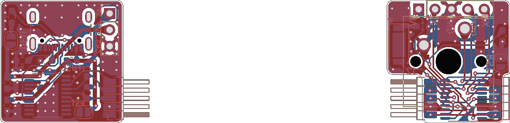
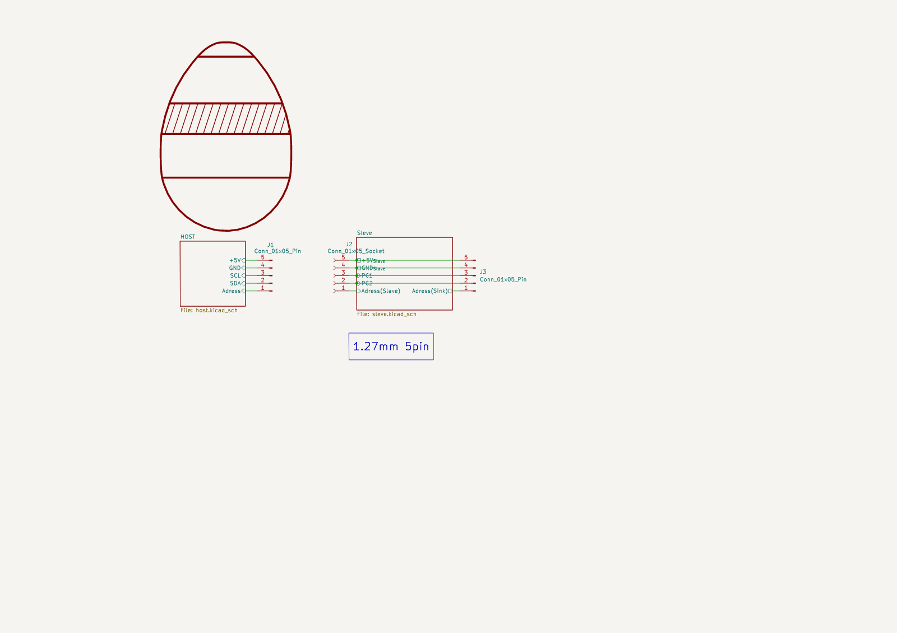

# OSASU-Keyboard（仮）
キーボードの回路データを共有するリポジトリです。

### Author
takeishi, wataken
### Tools
- kicad 9.0.6

### Schematic

<!-- kicadiff:preview:start -->
## PCB Preview

<!-- kicadiff:preview:end -->

<!-- kicadiff:viewer:start -->
## 🔍 [View interactive PCB/schematic diff](https://2k2e2n.github.io/OSASU_Keyboard/)
<!-- kicadiff:viewer:end -->
